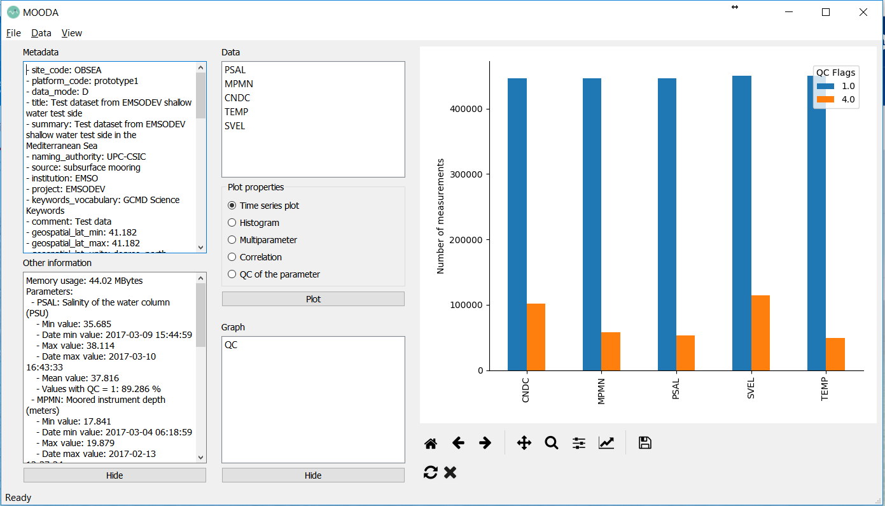
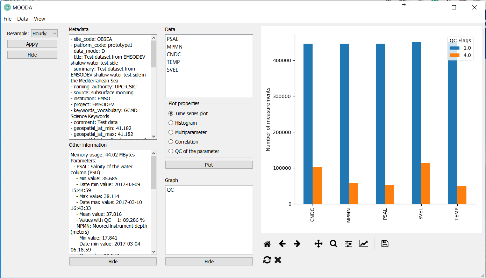
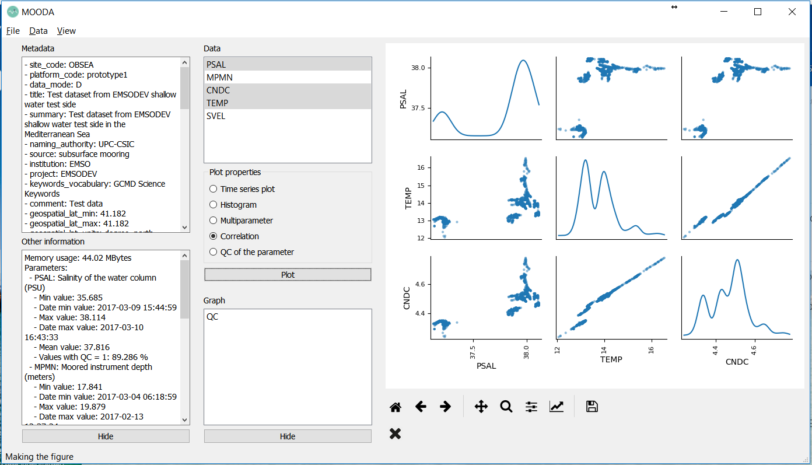

# Correlation between temperature, salinity and conductivity

For this example, we are going to use the CTD data of the EGIM of the EMSO Test Site OBSEA. You can download them [here](http://193.144.35.225/data/obsea/OS_OBSEA_2016120120170426_R_37-14998.nc).

Open the NetCDF file with:

```cmd
File -> Open
```



The file is quite big so, we are going to resample data hourly (averaging the measurements of each hour). Go to:

```cmd
Data -> Resample
```



Finally, select "Correlation" in the Plot properties, select PSAL, CNDC and TEMP (press Ctrl to pick them) and click the Plot button.


